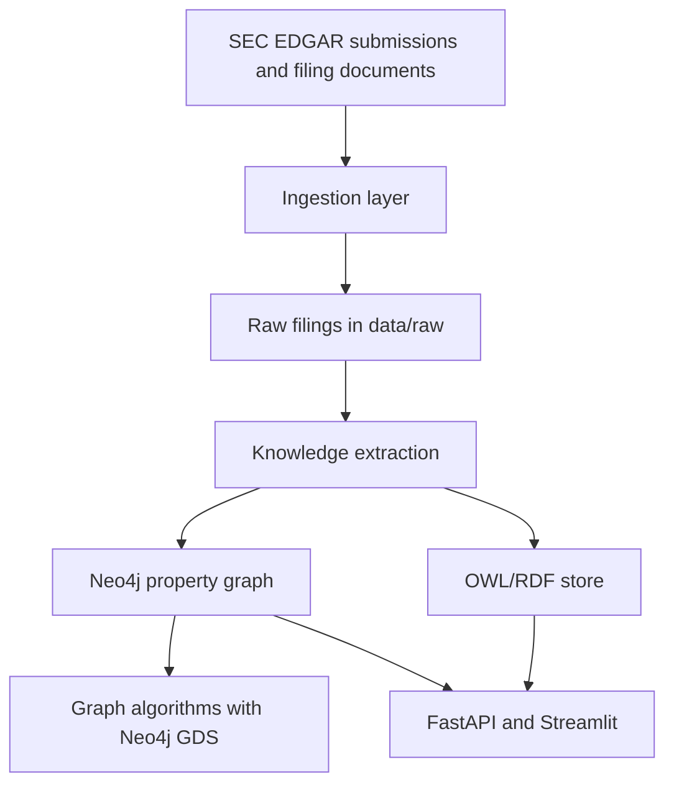
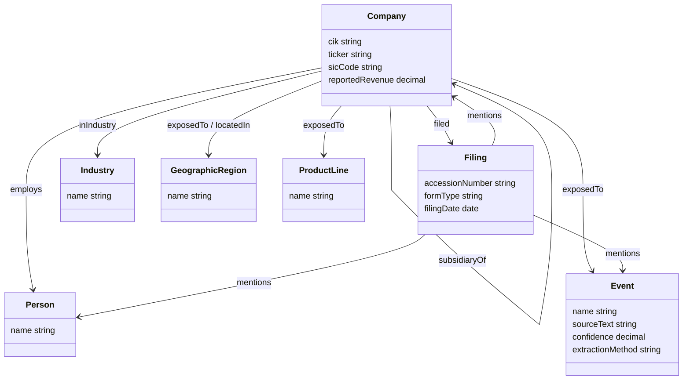

# Financial Knowledge Graph from SEC EDGAR

Financial knowledge graph over US public-company SEC filings. The project is being built in gated phases for a Point72-style knowledge graph portfolio: ingestion first, then ontology, extraction, dual graph storage, algorithms, API, and Streamlit demo.

## Architecture



## Ontology Schema

The Phase 2 ontology lives in [`ontology/financial_kg.ttl`](ontology/financial_kg.ttl), with design notes in [`ontology/README.md`](ontology/README.md). It keeps a compact project namespace while aligning the core financial concepts to FIBO where the mapping is clear.



## Phase 1 Scope

This phase sets up the foundation and SEC ingestion only.

- Docker Compose with Neo4j 5.x and Graph Data Science plugin enabled
- Rate-limited SEC EDGAR client with required User-Agent
- S&P 500 constituent loader
- Latest 10-K filing downloader
- Local folder convention for raw filings

Later phases will add ontology design, extraction, RDF/SPARQL, graph algorithms, API, and dashboard.

## Setup

Create a local environment:

```bash
uv sync --extra dev
```

Create a `.env` file:

```bash
cp .env.example .env
```

Edit `SEC_USER_AGENT` to a real contact string before making SEC requests. The SEC fair-access policy requires an identifying User-Agent, ideally with an email address.

Start Neo4j:

```bash
docker compose up neo4j
```

Neo4j Browser will be available at [http://localhost:7474](http://localhost:7474).

- Username: `neo4j`
- Password: `financial-kg-local`

Confirm Neo4j and GDS:

```cypher
CALL dbms.components();
RETURN gds.version();
```

Load the S&P 500 company index:

```bash
uv run python -m ingestion.sp500_loader
```

Smoke test with a smaller sample:

```bash
uv run python -m ingestion.sp500_loader --limit 5
```

Download latest 10-K filings:

```bash
uv run python -m ingestion.filing_downloader
```

Smoke test with a smaller sample:

```bash
uv run python -m ingestion.filing_downloader --limit 5
```

## Raw Filing Convention

Downloaded filings are stored under:

```text
data/raw/<form_type>/<ticker>_<zero_padded_cik>_<accession_number_without_dashes>.html
```

Example:

```text
data/raw/10-K/AAPL_0000320193_000032019325000079.html
```

## Phase 1 Checkpoint

Before moving to Phase 2, verify:

- Neo4j boots and `gds.version()` returns a version string
- SEC requests include a real User-Agent and respect the configured rate limit
- S&P 500 companies are loaded into `data/processed/sp500_companies.csv`
- Latest 10-K filings are downloaded into `data/raw/10-K/`
- `data/processed/filing_manifest.csv` records downloaded filing metadata
