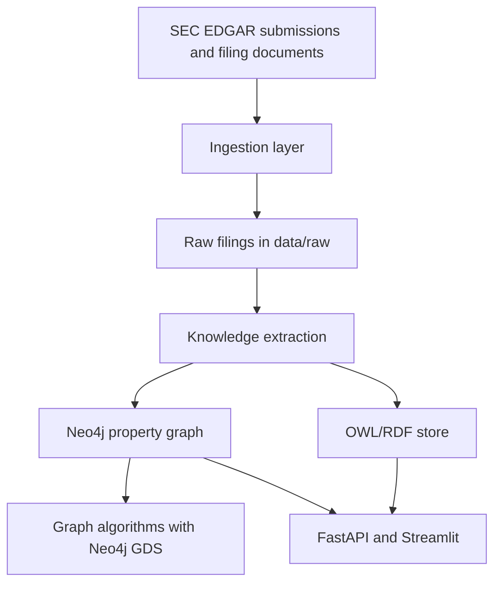
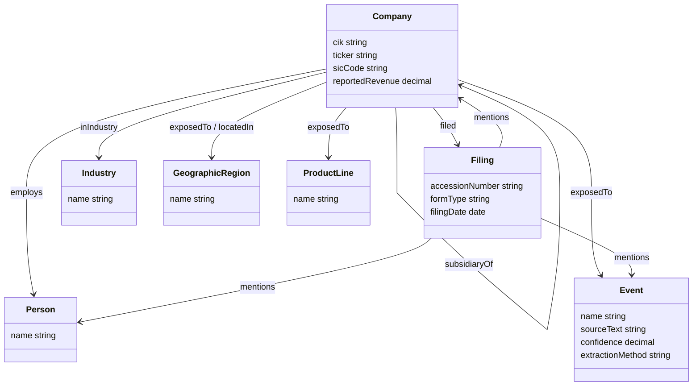

# Financial Knowledge Graph from SEC EDGAR

Financial knowledge graph over US public-company SEC filings. The project is built in gated phases for a Point72-style knowledge graph portfolio: ingestion, ontology, extraction, dual graph storage, algorithms, API, and Streamlit demo.

## Current Checkpoint

The repo is currently at **Phase 7: Streamlit dashboard over the pilot knowledge graph**.

Implemented:

- SEC filing ingestion and local manifest generation
- Financial ontology in Turtle/RDF with Neo4j loader mappings
- Filing-to-entity extraction with review-status quality gates
- Neo4j property graph and RDF/Turtle export validation
- Pilot graph algorithms with Neo4j Graph Data Science: PageRank, Louvain communities, and interpretable company similarity
- Read-only FastAPI layer for graph and algorithm queries
- Streamlit dashboard for reviewer-friendly exploration

The latest generated pilot artifacts are intentionally local-only under `data/`; code, ontology, API, dashboard, tests, and report templates are tracked so the run can be reproduced.

## Architecture



## Ontology Schema

The Phase 2 ontology lives in [`ontology/financial_kg.ttl`](ontology/financial_kg.ttl), with design notes in [`ontology/README.md`](ontology/README.md). It keeps a compact project namespace while aligning the core financial concepts to FIBO where the mapping is clear.



## Phase Roadmap

- Phase 1: SEC ingestion, S&P 500 company index, latest 10-K download workflow
- Phase 2: Financial ontology in RDF/Turtle with FIBO-aligned concepts
- Phase 3: Entity and relationship extraction from filing text
- Phase 4: Neo4j property graph, RDF export, and cross-store validation
- Phase 5: Pilot graph algorithms with Neo4j GDS and explainable similarity
- Phase 6: Read-only FastAPI query layer
- Phase 7: Streamlit dashboard over the API

Later optional phases can expand extraction quality, alias resolution, Node2Vec/link prediction, and hosted deployment.

## Setup

Create a local environment:

```bash
uv sync --extra dev
```

Create a `.env` file:

```bash
cp .env.example .env
```

Edit `SEC_USER_AGENT` to a real contact string before making SEC requests. The SEC fair-access policy requires an identifying User-Agent, ideally with an email address.

Start Neo4j:

```bash
docker compose up neo4j
```

Neo4j Browser will be available at [http://localhost:7474](http://localhost:7474).

- Username: `neo4j`
- Password: `financial-kg-local`

Confirm Neo4j and GDS:

```cypher
CALL dbms.components();
RETURN gds.version();
```

Load the S&P 500 company index:

```bash
uv run python -m ingestion.sp500_loader
```

Smoke test with a smaller sample:

```bash
uv run python -m ingestion.sp500_loader --limit 5
```

Download latest 10-K filings:

```bash
uv run python -m ingestion.filing_downloader
```

Smoke test with a smaller sample:

```bash
uv run python -m ingestion.filing_downloader --limit 5
```

Run the 25-company pilot extraction and graph load:

```bash
uv run python -m extraction.run_sample --tickers pilot25 --output data/extracted/phase4_pilot25_extraction.jsonl --stats-output data/extracted/phase4_pilot25_stats.json
uv run python -m loading.review_export --sample-path data/extracted/phase4_pilot25_extraction.jsonl --output data/extracted/phase4_pilot25_relationship_review.csv
uv run python -m loading.neo4j_loader --sample-path data/extracted/phase4_pilot25_extraction.jsonl --reset
uv run python -m loading.rdf_loader --sample-path data/extracted/phase4_pilot25_extraction.jsonl --output data/rdf/phase4_pilot25_graph.ttl
uv run python -m loading.validate --rdf-path data/rdf/phase4_pilot25_graph.ttl
```

Run pilot graph algorithms after Neo4j is loaded:

```bash
uv run python -m algorithms.run_all
```

Algorithm outputs:

- `data/algorithms/pagerank.csv`: focal-company PageRank and graph degree
- `data/algorithms/communities.csv`: Louvain community assignment with community size
- `data/algorithms/similarity.csv`: explainable company similarity from shared extracted graph features
- `algorithms/community_report.md`: tracked summary report for the latest pilot run

Start the read-only API:

```bash
uv run uvicorn api.main:app --reload --host 127.0.0.1 --port 8000
```

Useful API routes:

- `GET /health`: Neo4j connectivity check
- `GET /summary`: node, relationship, and review-status counts
- `GET /companies?limit=25`: focal SEC filers with graph degree
- `GET /companies/{ticker}`: company metadata and filing references
- `GET /companies/{ticker}/neighbors`: extracted graph relationships around one company
- `GET /algorithms/pagerank`: generated PageRank output
- `GET /algorithms/communities`: generated Louvain community output
- `GET /algorithms/similarity`: generated explainable similarity output

Start the Streamlit dashboard in a second terminal:

```bash
uv run streamlit run dashboard/app.py
```

The dashboard expects the API at `http://127.0.0.1:8000` by default. Override with:

```bash
KG_API_BASE_URL=http://127.0.0.1:8000 uv run streamlit run dashboard/app.py
```

## Validation

Run local quality checks:

```bash
uv run --extra dev ruff check .
uv run --extra dev python -m pytest -q
```

The current test suite covers SEC client behavior, extraction helpers, graph loading/RDF utilities, FastAPI routes with a fake Neo4j driver, and dashboard API-client helpers.

For a live smoke test after Neo4j, API, and Streamlit are running:

```bash
curl http://127.0.0.1:8000/health
curl "http://127.0.0.1:8000/companies?limit=3"
curl "http://127.0.0.1:8000/algorithms/pagerank?limit=3"
```

## Known Limitations

- The default reproducible graph is a 25-company pilot, not a full S&P 500 graph.
- Relationship extraction is review-gated; heuristic and LLM-assisted edges should not be treated as audited truth.
- Some extracted company aliases and subsidiaries still need stronger entity-resolution cleanup.
- PageRank, Louvain, and explainable similarity are implemented; Node2Vec and link prediction are future optional work.
- Generated data under `data/` is local-only and intentionally not committed.

## Raw Filing Convention

Downloaded filings are stored under:

```text
data/raw/<form_type>/<ticker>_<zero_padded_cik>_<accession_number_without_dashes>.html
```

Example:

```text
data/raw/10-K/AAPL_0000320193_000032019325000079.html
```
